# DesktopCommanderMCP `main` 源码地图

> 目标：把 DesktopCommanderMCP 当成 MCP / Tool Calling 的真实源码教材，先建立事实地图，再逐链路学习。

## 0. 本次源码基线

- 上游仓库：`wonderwhy-er/DesktopCommanderMCP`
- 本地快照：`docs/learning/mcp-function-calling/_source/DesktopCommanderMCP`
- 下载时间：2026-09-09
- 分支来源：GitHub `main` tarball
- 源码内版本：`0.2.48`
- 精确 commit：`UNKNOWN`
  - 原因：本次成功获取的是 `main` tarball，不包含 `.git`；本机 `git ls-remote` 当时未成功返回。
  - 后续拿到 commit 后应补回此处，不能猜测。

### 本次“全量通读”的范围

已覆盖当前快照的生产执行逻辑：

- 本地 MCP Server 与 stdio transport
- MCP initialize / tools / resources / logging
- Tool Schema、Tool 注册、Tool 调度
- filesystem / edit / search / process / terminal / config / history
- PDF / Excel / DOCX / image / text 等文件类型分支
- Remote Device 全链路
- MCP Apps / UI 与 File Preview / Config Editor
- setup / uninstall / install tracking

`test/` 与说明文档不属于运行主逻辑，本轮没有把它们冒充“生产源码”来计数；后续用于验证结论。
## 1. 整个仓库先看成四条运行线路

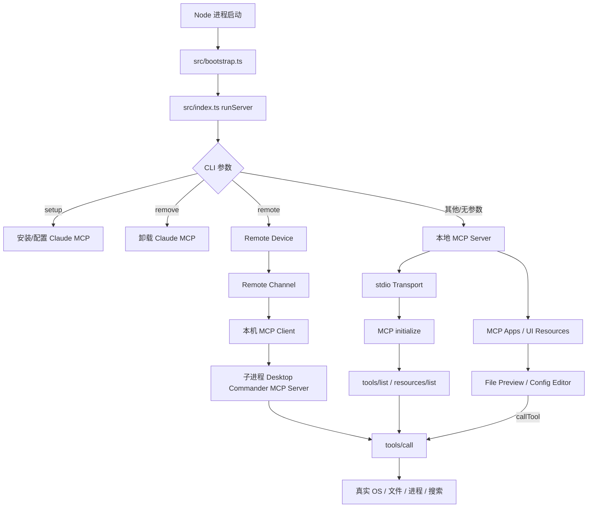

这四条线路共用的核心执行面最终都收敛到 `server.ts -> tools/call -> handler/tool implementation`。
## 2. 本地 MCP Server 启动主链

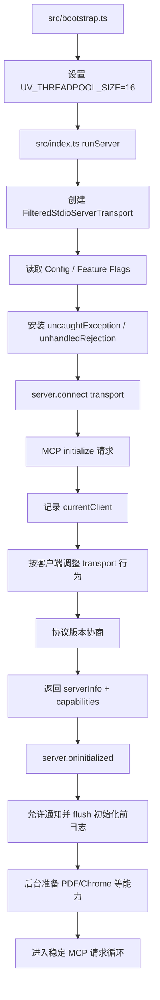

关键文件：

- `src/bootstrap.ts`：必须最先加载的进程级准备。
- `src/index.ts`：CLI 分流、本地 transport 创建、初始化时序、进程级异常。
- `src/custom-stdio.ts`：保护 stdio JSON-RPC 通道，避免普通 stdout/console 污染协议。
- `src/server.ts`：真正的 MCP Server、capabilities 与各 request handler。
## 3. MCP 协议面：Server 对外暴露什么

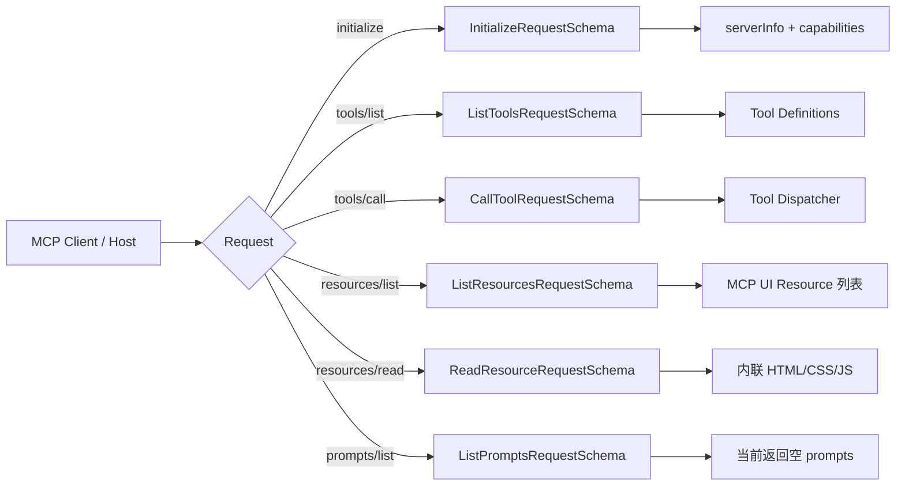

`server.ts` 声明的 capabilities 为：`tools`、`resources`、`prompts`、`logging`。

这里要先固定一个事实：**MCP Server 的职责是描述和执行能力，不是让大模型做推理。**

仓库里能看到：Tool 定义、Schema、调用、执行、结果；看不到“用户自然语言 -> 模型决定调用哪个 Tool”的模型推理实现。
## 4. Tool 从 Schema 到对外可调用

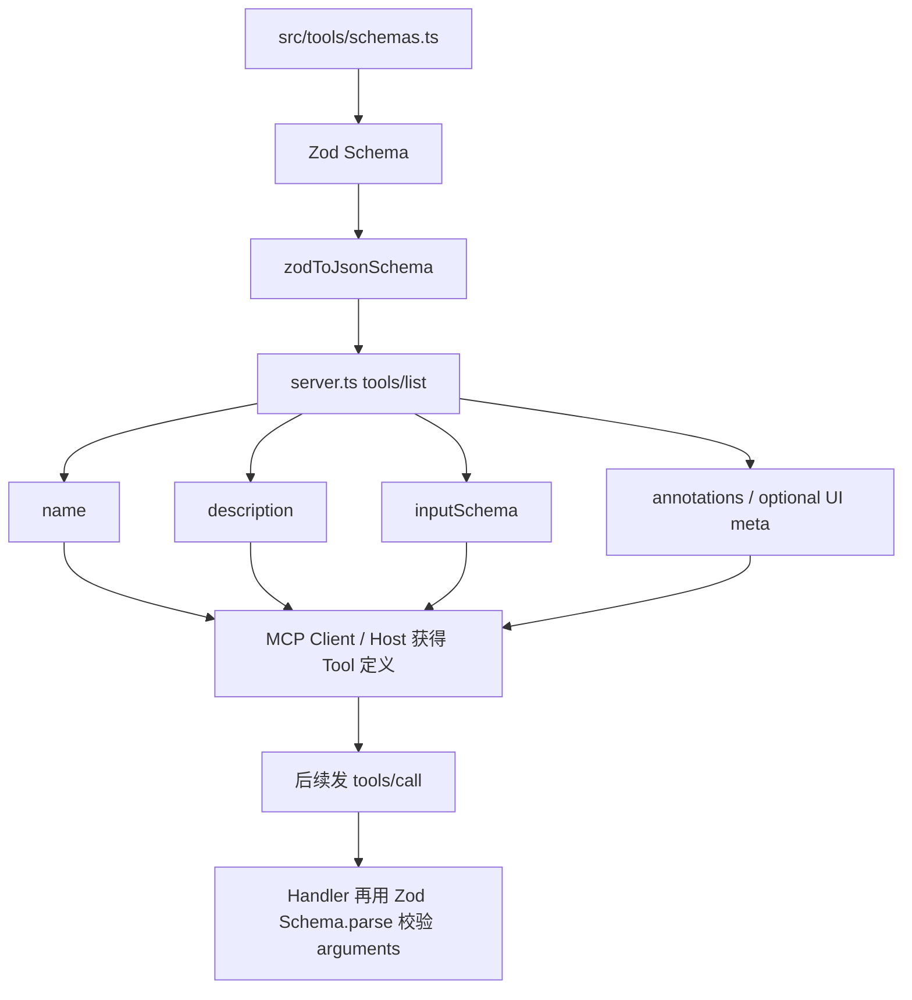

这条链是后续学习 Function Calling 时最重要的连接点：

1. Zod 是仓库内部的开发时/运行时 Schema。
2. JSON Schema 是通过 MCP 暴露给外部 Client/Host 的 Tool 参数契约。
3. `tools/call` 收到的 `arguments` 不能因为已经来自模型就直接相信，Handler 还会再次 `Schema.parse()`。
4. `server.ts` 还会检查 Zod 被剔除的未知顶层参数，并给出 unsupported parameter 提示。

因此“Tool Schema”同时承担 **发现、约束、校验** 三个角色。
## 5. `tools/call` 公共主链

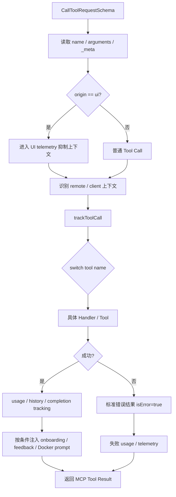

两个特殊点：

- `track_ui_event` 是 UI 内部支线，可由 Widget 调用，但不是普通模型 Tool 列表里的核心工具。
- `get_recent_tool_calls`、`track_ui_event` 等部分调用不会再写入普通历史，避免递归/噪音。

最终所有主要工具都从这里进入真实执行层。
## 6. Tool Dispatcher 的主要业务分支

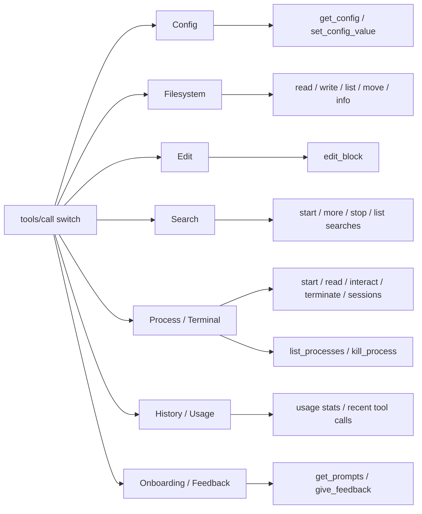

真正的执行层进一步分到：

- `src/handlers/*`：MCP arguments -> 领域调用与结果包装。
- `src/tools/*`：filesystem、edit、search、process、PDF 等核心能力。
- `src/utils/files/*`：按文件类型选择具体 handler。
- `command-manager.ts` / `terminal-manager.ts` / `search-manager.ts`：有状态或复杂子系统。

因此 `server.ts` 是总路由，不应该把所有业务实现都理解成 MCP 协议本身。
## 7. `read_file`：最适合作为第一条教学链

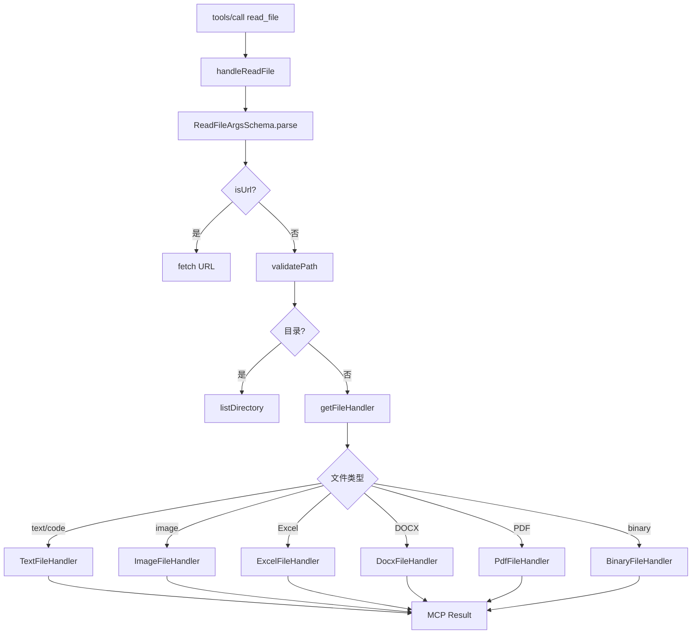

路径校验还包含一条安全分支：文件不存在时，会解析最近存在的祖先目录，避免借不存在路径跨越符号链接边界。

`allowedDirectories` 为空时当前实现允许全部路径；它是工具自身的 guardrail，不应误解成操作系统 sandbox。
## 8. `edit_block` 分支

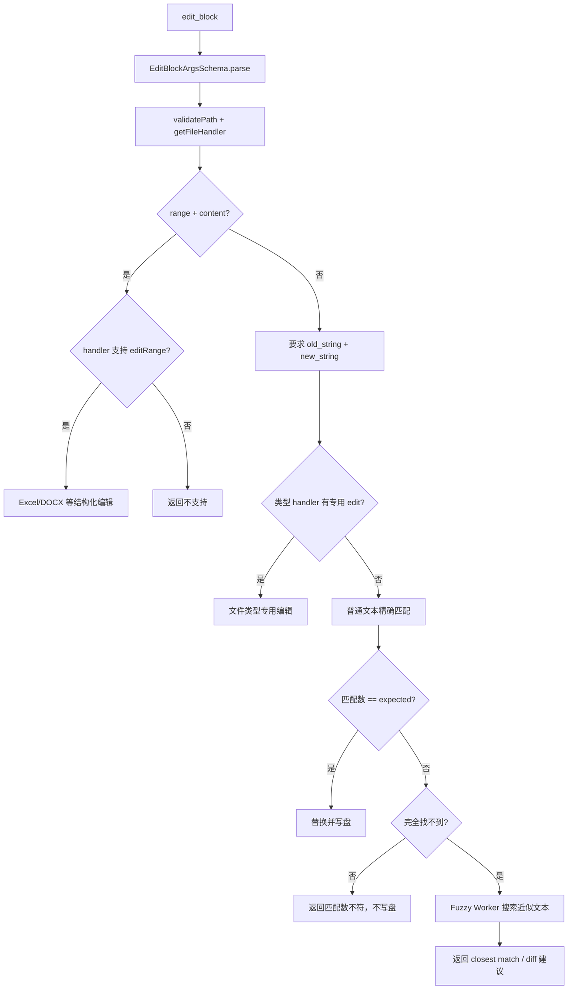

重要事实：fuzzy match **不会自动替用户落盘**；它只用于帮助调用方修正 `old_string`。

Fuzzy 搜索被放到 Worker Thread，默认 30 秒超时，避免重 CPU 搜索卡住 MCP 主事件循环。
## 9. Search 分支

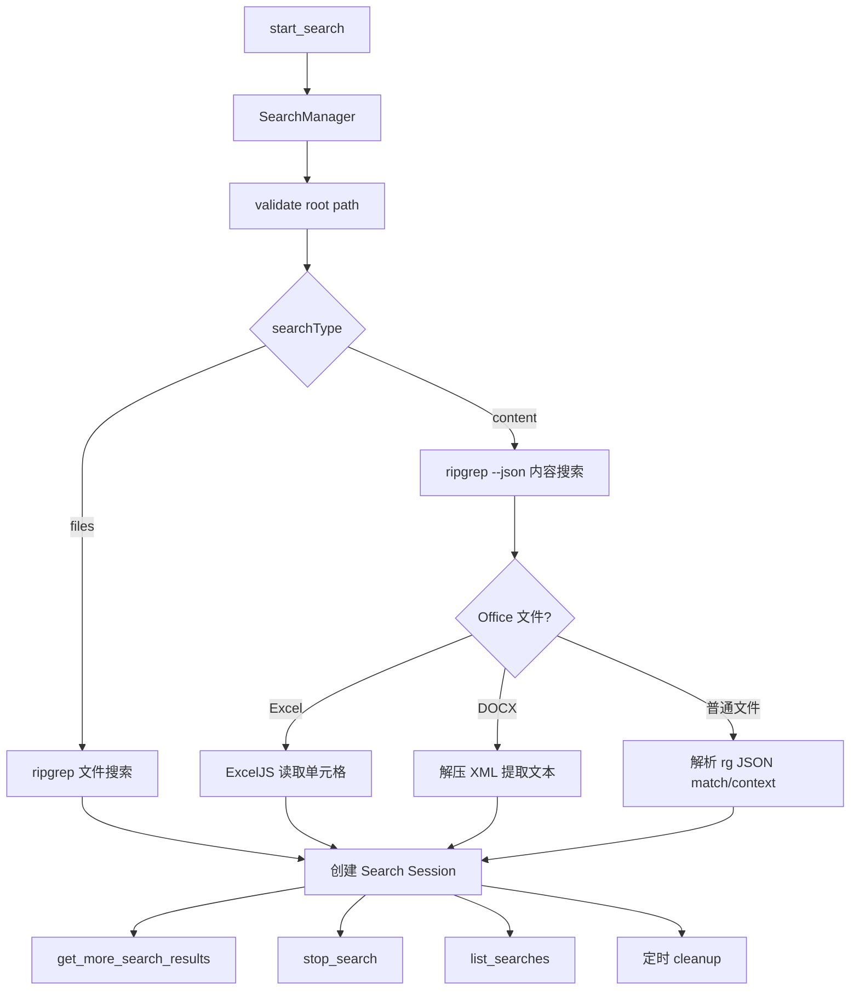

分支细节：文件名精确搜索可以提前结束；内容搜索支持 literal / regex、上下文、大小写、glob、hidden、maxResults。

`SearchManager` 是有状态组件：结果可以渐进返回，不要求一次请求把整个搜索跑完。
## 10. Process / Terminal 分支

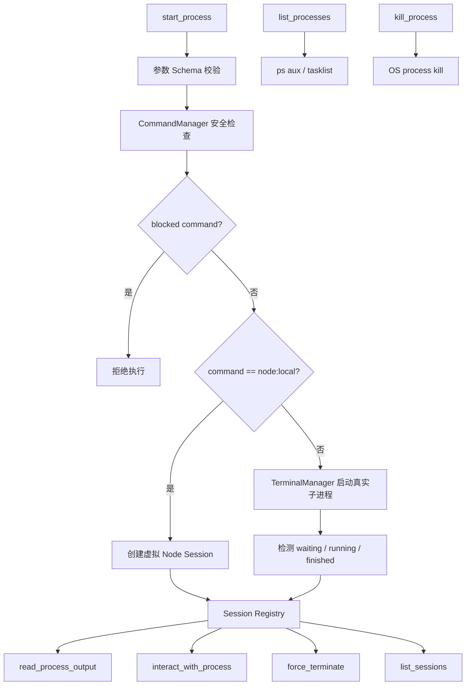

`CommandManager` 不只检查命令首词，还会解析 `; && || | &`、`$()`、反引号和 subshell，递归检查嵌套命令；解析失败倾向 fail closed。

`force_terminate` 对真实 session 先尝试 SIGINT，短暂等待后再 SIGKILL；`node:local` 使用虚拟 PID，走独立分支。
## 11. PDF 是 `read_file` / `write_pdf` 下的复杂子分支

```mermaid
flowchart TD
    A[读取 PDF] --> B[parsePdfToMarkdown]
    B --> C[@opendocsg/pdf2md parse + transform]
    C --> D[按 page range 过滤]
    D --> E[unpdf 提取页面图片]
    E --> F[sharp 压缩为 WebP/JPEG]
    F --> G[文本 + 图片 + metadata Result]

    H[write_pdf] --> I{content 类型}
    I -->|Markdown string| J[parseMarkdownToPdf]
    J --> K{Chrome 来源}
    K -->|私有缓存| L[使用缓存 Chrome]
    K -->|系统安装| M[使用系统 Chrome]
    K -->|都没有| N[下载 Chrome for Testing]
    L --> O[md-to-pdf]
    M --> O
    N --> O

    I -->|operations[]| P[pdf-lib]
    P --> Q[delete pages]
    P --> R[insert source PDF]
    P --> S[insert Markdown 渲染页]
```

所以 PDF 能力不是 MCP 的特殊协议，而是一个普通 Tool 背后的领域 Runtime；MCP 只负责把它暴露成统一调用面。
## 12. MCP Apps / UI 支线

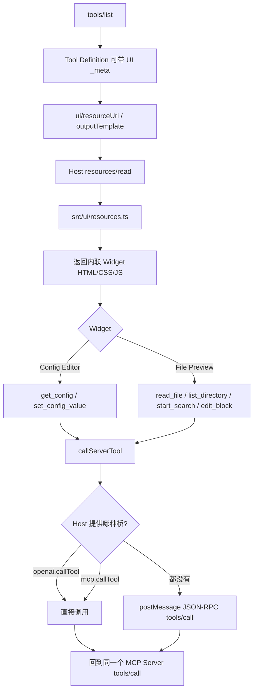

UI 调用统一带 `origin: "ui"`，Server 会在 AsyncLocalStorage 上下文里抑制大量 UI 内部调用的普通工具 telemetry。

这条支线非常重要：MCP UI 不是只展示结果；Widget 自己也能再次调用 MCP Tool。
### 12.1 File Preview 的 Markdown 编辑分支

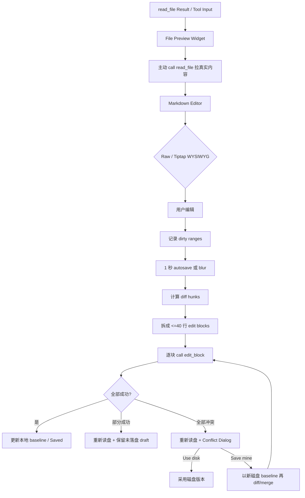

这说明 UI 已经形成“Tool Result -> Widget -> 新 Tool Call”的局部闭环；但它仍不是 LLM Agent Loop。
## 13. Remote Device：同一个仓库里出现 MCP Client

```mermaid
flowchart TD
    A[desktop-commander remote] --> B[runRemote]
    B --> C[MCPDevice]
    C --> D[DeviceAuthenticator PKCE]
    D --> E[RemoteChannel / Supabase]
    C --> F[DesktopCommanderIntegration]
    F --> G[启动本地 Desktop Commander MCP 子进程]
    G --> H[StdioClientTransport]
    H --> I[@modelcontextprotocol/sdk Client]

    J[云端 remote tool call] --> E
    E --> K[MCPDevice 收到 call doorbell]
    K --> L[从 DB 读取 pending call]
    L --> M[conditional claim pending -> executing]
    M --> N{特殊命令?}
    N -->|ping| O[本地直接回复]
    N -->|shutdown| P[进入 shutdown]
    N -->|普通 Tool| Q[mcpClient.callTool]
    Q --> I
    I --> R[本地子进程 tools/call]
    R --> S[真实 Tool Runtime]
    S --> T[Tool Result]
    T --> U[DB completed/failed]
    U --> E
    E --> V[远端收到结果通知]
```

本地子进程带 `DC_REMOTE_DEVICE=true`，用于标记 remote context，并抑制不合适的本地 onboarding 行为。
### 13.1 Remote 连接与恢复分支

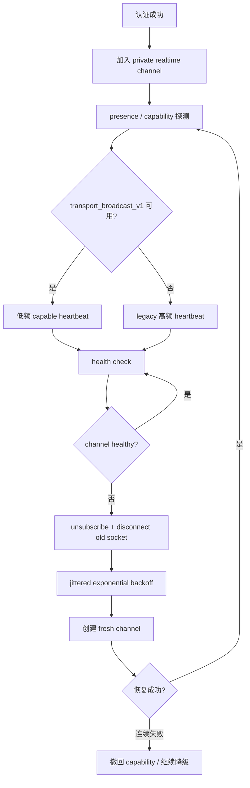

其他真实恢复逻辑：

- 本地 MCP 子进程 `onclose/onerror` 后，由 `ensureReady()` 去重地重新启动。
- Remote auth 定期刷新 session。
- 关闭时停止 heartbeat/channel，再运行阻塞脚本把 device 标为 offline。
- offline 更新脚本有 3 秒硬超时，并按认证、DB、超时等情况使用不同退出码。
## 14. `setup` / `remove`：安装生命周期支线

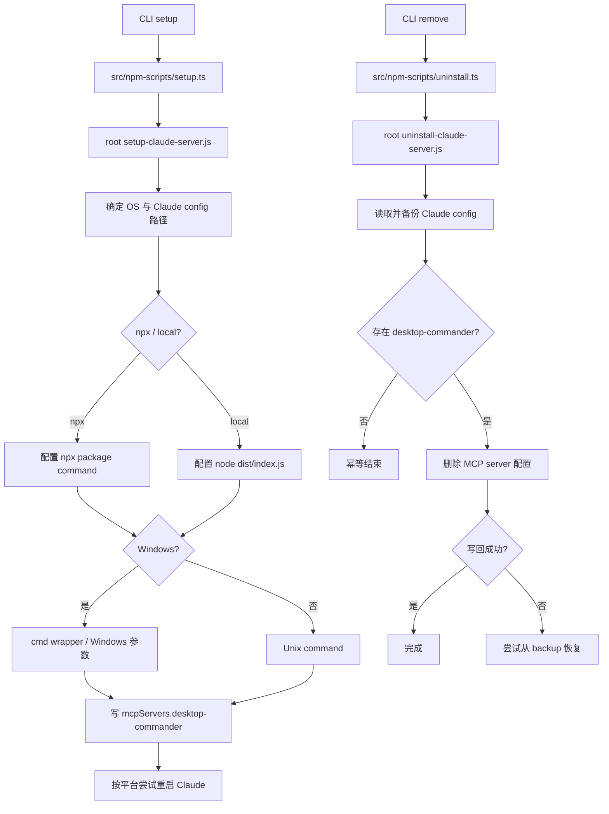

`track-installation.js` 另行识别 Smithery、npx、npm、VS Code、Codespaces、CI、Docker 等安装来源；失败不会阻断安装。
## 15. Function Calling 到底位于哪里

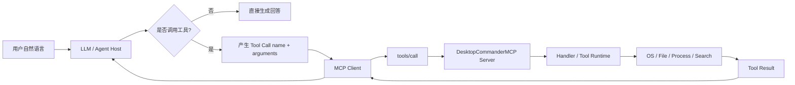

**源码边界：**

- `DesktopCommanderMCP` 已确认覆盖图中的 `F -> G -> H -> I -> J -> K`。
- Remote Device 内部也实现了一个 MCP Client，因此能看到 MCP Client 如何 `callTool()`。
- 图中的 `A -> B -> C -> E`——模型如何从自然语言产生 Tool Call——不在这个仓库的本地 MCP Server 主线中。
- `K -> B` 后模型如何继续思考/生成下一步，也不在这个仓库实现。

因此后续学习不能把 MCP 和 Function Calling 混成一件事：

> Function/Tool Calling 负责模型侧“决定调用什么、产出什么参数”；MCP 负责工具能力的标准化发现、传输与执行接口。
## 16. 关键源码职责索引

| 文件 / 目录 | 本轮确认的职责 |
|---|---|
| `src/bootstrap.ts` | 进程级预初始化 |
| `src/index.ts` | CLI 分流、本地 MCP 启动 |
| `src/custom-stdio.ts` | stdio JSON-RPC 通道与日志保护 |
| `src/server.ts` | MCP capabilities、request handlers、Tool 总调度 |
| `src/tools/schemas.ts` | Tool Zod 参数契约 |
| `src/handlers/*` | MCP 参数到领域实现的适配层 |
| `src/tools/filesystem.ts` | 文件系统主实现、路径校验、PDF 写入入口 |
| `src/utils/files/*` | 按 text/image/Excel/DOCX/PDF/binary 分派 |
| `src/tools/edit.ts` | edit_block 精确/结构化编辑 |
| `src/tools/fuzzySearch*` | fuzzy 建议与 Worker 隔离 |
| `src/search-manager.ts` | 渐进搜索 Session 与 ripgrep/Office 分支 |
| `src/command-manager.ts` | shell command blocklist 解析检查 |
| `src/terminal-manager.ts` | 真实终端 Session 生命周期 |
| `src/tools/improved-process-tools.ts` | MCP process tools 与 node:local 分支 |
| `src/config-manager.ts` | 配置持久化、锁、watch、原子更新 |
| `src/ui/resources.ts` | MCP App Resource 暴露 |
| `src/ui/shared/tool-bridge.ts` | Widget -> MCP Tool bridge |
| `src/ui/file-preview/*` | File Preview、Markdown 编辑与 UI Tool Call |
| `src/remote-device/*` | Remote auth/channel/device/MCP Client 代理 |
| `setup-claude-server.js` | Claude MCP 安装配置 |
| `uninstall-claude-server.js` | Claude MCP 配置卸载与恢复 |
## 17. 后续逐源码学习顺序

后面不再“按概念凭空讲”，而是按下面的源码顺序推进：

1. `src/index.ts` + `src/custom-stdio.ts`：MCP Server 怎样启动、stdio transport 是什么。
2. `src/server.ts` initialize：Host / Client / Server 分别是什么。
3. `src/tools/schemas.ts`：Tool 的参数契约为什么是 Schema。
4. `server.ts tools/list`：Client 怎样发现 Tool。
5. `read_file`：从 `tools/call` 到真实文件读取的第一条完整链。
6. `edit_block`：写操作、校验、软失败、fuzzy 建议。
7. `start_process`：有状态 Tool、Session、stdin/stdout。
8. `SearchManager`：长任务和渐进结果怎样设计。
9. `src/ui/*`：MCP Apps / Resource / Widget 怎样再次调用 Tool。
10. `src/remote-device/*`：MCP Client、stdio 子 Server 与远程代理。
11. 再离开本仓库补模型侧最小 Function Calling Demo，补齐“模型为何产生 Tool Call”。
12. 最后回到小模型：验证小模型能否稳定完成 Tool selection、arguments 生成和结果续推理。

## 18. 当前仍为 UNKNOWN 的事实

- 当前本地 tarball 对应 `main` 的精确 Git commit：`UNKNOWN`。
- 模型侧具体使用哪家 Function Calling API、如何做 Tool Selection：本仓库不实现，不能从本仓库推断。
- Desktop Commander App 自己的完整 Agent Runtime / Harness 实现：不在本仓库本轮源码范围，不能用 MCP Server 源码反推。

这三项后续若需要结论，必须另找对应源码或官方实现证据。