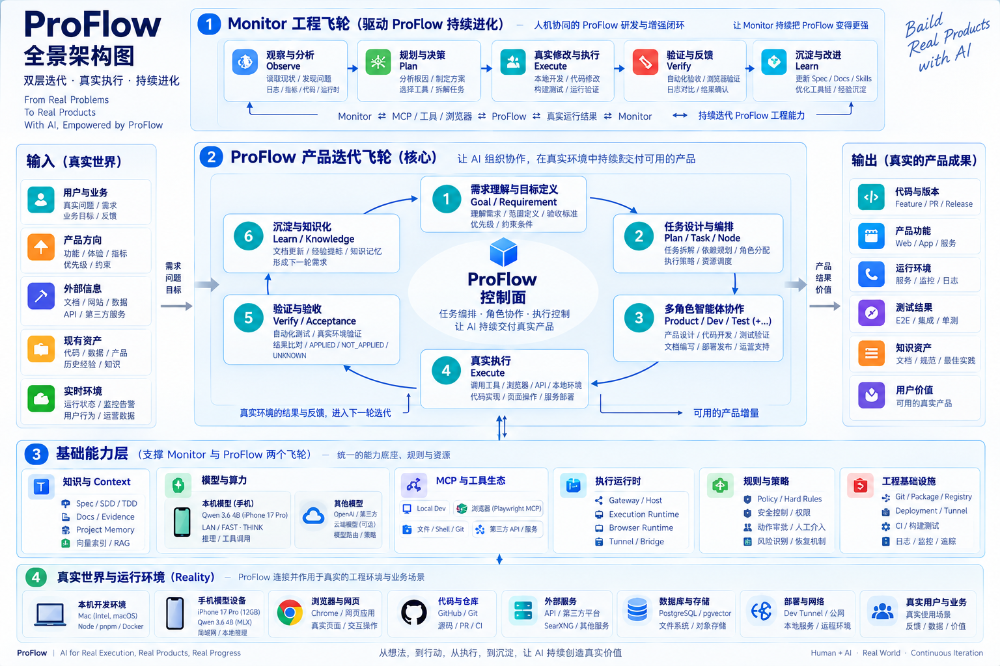

# ProFlow｜从多智能体对话到持续产品迭代系统

ProFlow 是一套围绕真实产品迭代建立的智能体工程系统。它复用 ChatGPT 的对话、模型、文件和 Custom GPT（定制 GPT：由固定指令、知识和 Actions 组成的长期角色载体），但把 Task（任务）、身份、权限、真实副作用、恢复、部署和验收这些长期事实留在自己的 Control Plane（控制面：保存正式业务事实、状态转换和恢复规则的系统层）里。

它要解决的不是“怎样让多个 Agent 多聊几轮”，而是一个更难的工程问题：**一个产品目标怎样在跨 Chat、跨浏览器、跨进程和跨版本的真实环境里持续推进，同时始终知道谁拥有事实、什么动作真正发生过、失败以后从哪里恢复、什么证据才足以宣布完成。**



## 90 秒看懂 ProFlow

如果只快速判断这套系统值不值得继续读，可以先看五个问题。

| 工程问题 | ProFlow 的处理方式 | 解决的风险 |
| --- | --- | --- |
| 多个智能体怎样不互相抢决定权 | Fact Owner（事实归属方：某类正式事实唯一可信来源）+ Task / Agent / Execution / Model / Deployment 五领域 | 模型、浏览器、运行时各自保存一份“真相” |
| 浏览器里的 Agent 怎样跨刷新和重启继续工作 | Role / Worker / Conversation 稳定身份与 Browser Driver（浏览器驱动层）分离 | Tab、窗口或页面实例被误当业务身份 |
| timeout 后怎样判断真实副作用有没有发生 | `APPLIED / NOT_APPLIED / UNKNOWN` 三态 + Reality Reconciliation（真实结果核对：回到权威现实确认实际状态） | 把 timeout 当失败后盲目重试，产生重复副作用 |
| AI 长期开发大型工程怎样不把架构修歪 | DDD（领域驱动设计）、SDD（规格驱动设计）、TDD（测试驱动开发）、阶段冻结和真实验收 | 为修一个局部测试而悄悄改变 Owner、契约或状态机 |
| 源码通过为什么还不能宣布产品可用 | Source → Package → Registry → Installed → Runtime / Product 五层真值 | 新源码没有真正进入包、工作区、进程、Extension 或用户路径 |

这五个问题也是整组文章的主线。后面的浏览器扩展、手机模型、MCP（模型上下文协议：让 Chat 接入本机或外部工具的标准机制）、部署、验收和 Monitor，都不是孤立的“技术点”，而是在解决这些长期运行问题。

## 系统现在由什么组成

ProFlow 当前把长期业务事实拆成五个领域：

| 领域 | 它拥有的核心事实 | 它回答的问题 |
| --- | --- | --- |
| Task / 任务与编排 | Task、Node、版本、运行轮次、角色绑定、正式任务文档、产品意图与 Campaign | 工作现在做到哪里，何时可以开始、等待、失败、完成或进入下一轮 |
| Agent / 智能体运行与协作 | Agent Package、Role、Product Discussion、协作消息 | 谁承担什么岗位，哪条 Conversation 属于哪个工作身份 |
| Execution / 执行 | Intent、Effect、Approval、Result、Artifact、Evidence、UNKNOWN | 一个真实动作到底有没有发生，能否安全恢复或重试 |
| Model / 模型与推理 | FAST / REASON、Capability Profile（能力档案：通过真实探测记录模型实际能力）、队列和 Provider 调用 | 哪种推理能力当前真实可用，怎样受控调用 |
| Deployment / 部署治理 | Module 生命周期、外部资源、包版本、安装与运行状态 | 这套能力怎样真正进入当前机器和外部资源 |

`platform-host` 是 Composition Root（组合根：把各领域运行组件装配在一起的入口），不是第六个业务领域。Gateway、Browser Extension、MCP、Provider 等是连接这些领域与真实世界的 Adapter / Driver（适配器 / 驱动层），它们可以很主动，但不能因为位于链路中央就接管业务真值。

最重要的权威顺序可以压成一行：

```text
Owner current fact
> deterministic policy / invariant
> model assessment
> Conversation / DOM / log guess
```

也就是：**现实和正式 Owner 优先，模型判断不能覆盖已经成立的业务事实。**

## ProFlow 不是一次设计出来的：五个阶段解决五类问题

### 第一阶段｜先验证路线能不能成立

项目最初面对的是最基础的问题：Custom GPT 能不能安全地调用本机 Mac 能力，ChatGPT 能不能作为成熟宿主被复用，公网入口、Actions、Gateway、本机执行和权限链能不能形成最小闭环。

这个阶段使用 MVP（最小可行产品：用最低成本验证关键假设的版本）和原型尽早撞假设。Cloudflare 等路线真实试过，也真实放弃过。目标不是把原型打磨成生产系统，而是确认：哪些能力值得复用，哪些边界必须自己拥有，真正困难的地方在哪里。

### 第二阶段｜把原型收敛成有 Owner 的工程系统

原型跑通后，问题从“能不能做”变成“长期应该怎么做”。项目开始用 DDD 划分事实归属，用第一性原理删除没有独立价值的复杂度，用 SDD 冻结契约、状态和失败语义，再把这些承诺变成可执行测试和模块实现。

这个阶段大量工作其实是做减法：万能 Browser 工作流被拆掉，Product GPT 的确定性初始化权回到 Task / Application，重复 Owner 的 `chatgpt-carrier` 和中央 Deployment Planner 被删除。设计目标从“一个更聪明的总控”转成“多个边界清楚、可以各自恢复的 Owner”。

### 第三阶段｜从代码正确推进到真实环境成立

单元测试和构建通过以后，系统仍然可能在真实 Browser、Custom GPT、Tunnel、模型服务、包仓库和 Fresh Workspace（全新工作区：不依赖旧缓存和历史安装状态的用户环境）里失败。

于是验证开始分层：源码与契约测试、Package 验证、Real-1 / Real-2 / Real-3、SAME SCENE（原失败场景复测）、FAST REPLAY（只重放受影响下游的快速验证）和 FULL FRESH（全新环境完整验收）各自证明不同层级。这个阶段形成了 ProFlow 很重要的一条纪律：**上游通过，不能冒充下游真实成立。**

### 第四阶段｜让一次 Task 成功变成持续产品迭代

Phase 4（第四阶段）不再只问“一个 Task 能不能成功”，而是把 Product Discussion、Product Intent、Campaign Authorization、Product / Dev / Test 三角色、真实验收和 Product Gap Review（产品差距复盘：基于上一轮真实结果判断是否值得继续）接成持续产品循环。

```text
真实产品目标
→ 产品讨论与约束收敛
→ 有界 Product Intent
→ Task / Product / Dev / Test
→ 真实执行与独立验证
→ 产品结果
→ Gap Review
   ├─ 有新的实质差距和证据 → 下一份有界 Task
   └─ 已满足目标 → Closure
```

这里故意把“产品 Goal 可以持续演进”和“单个 Task 必须有结束条件”分开。系统不能因为 Agent 还能想到优化点就无限续轮。

### 第五阶段｜让产品飞轮最终能作用于 ProFlow 自身

Phase 5 是未来方向，不是当前已完成能力。目标是让 ProFlow 最终可以把自己也当成被迭代产品，但仍保留人类对目标、成本、权限和高风险决策的控制，也保留独立测试与真实验收。

当前 Monitor 工程飞轮还属于“Chat 使用工程工具持续开发和验证 ProFlow”；它已经比人工接力更自动，但不能把它写成“ProFlow 已经自主完成自我迭代”。

## 两个飞轮不是并列的两个产品系统

ProFlow 的主角始终是产品迭代飞轮：

```text
产品目标
→ Task / Agent / Execution
→ 真实产品增量
→ Test / Acceptance
→ Product Review
→ 下一轮或收口
```

Monitor（工程监控与自迭代通道：观察、修复和验证 ProFlow 自身的普通 Chat 流程）位于外层，负责在真实产品暴露平台缺口时修 ProFlow，再把系统送回原产品场景。

```text
Monitor 工程飞轮
观察 ProFlow → 修复 → 验证 → 回原场景
                │
                ▼
ProFlow 产品飞轮
理解目标 → 编排 → 执行 → 验收 → 产品续轮
```

它们共享知识、模型算力、MCP 与工程工具、浏览器、本机 Runtime、Git、Package、网络和真实用户环境，但职责不同。Monitor 不是第四个产品 Agent，也不替 Product / Dev / Test 做业务裁决。

## 这套系统最值得追问的不是功能列表，而是几个设计取舍

第一，**为什么复用 ChatGPT，却不把 Task 和权限放在 ChatGPT 里？** 因为 Host 可以变化，而产品长期事实必须可恢复。这个问题在 [02｜为什么选择 ChatGPT，又为什么必须拥有自己的 Control Plane](./02-为什么选择ChatGPT又为什么必须拥有自己的Control-Plane.md) 展开。

第二，**为什么最后只有 Product / Dev / Test 三个长期 Agent？** 因为长期角色增加的是身份、权限、恢复和验收空间，不是免费的“智力”。角色压缩和身份模型见 [03｜多 Agent 如何从更多角色收敛成稳定协作系统](./03-多Agent如何从更多角色收敛成稳定协作系统.md)。

第三，**为什么浏览器扩展不是简单的自动化脚本？** 因为它同时承载 Worker、协作、Permission、产品会话、GPT 部署、Local Tool、Monitor 等多条真实流程，又不能重新成为业务大脑。详见 [04｜ProFlow 浏览器扩展如何驱动浏览器内各条流程](./04-ProFlow浏览器扩展如何驱动浏览器内各条流程.md)。

第四，**为什么 timeout 和重启会改变架构？** 因为真实副作用一旦可能已经发生，恢复就不能等价于重试。长期运行、UNKNOWN 和验收分层见 [05｜ProFlow 怎样从一次跑通走向长期可运行的工程系统](./05-ProFlow怎样从一次跑通走向长期可运行的工程系统.md)。

第五，**AI 为什么没有把工程流程变得更随意，反而需要更清楚的阶段门？** 因为 AI 很擅长局部优化，越需要把 Owner、契约、证明标准和停止条件冻结在局部 patch 之外。详见 [06｜ProFlow 如何用 AI 工程方法与实验治理控制复杂度](./06-ProFlow如何用AI工程方法与实验治理控制复杂度.md)。

第六，**为什么源码绿了以后还要花大量时间在发布、安装、Runtime adoption 和模型 probe？** 因为用户运行的是实际包和实际进程，不是 Git diff。详见 [07｜ProFlow 如何从源码走到真实可运行产品](./07-ProFlow如何从源码走到真实可运行产品.md)。

## 当前状态：哪些已经成立，哪些还不能写成完成

下面只记录 2026-09-17 当前可核对的层级，不把规划写成已完成能力。

| 项目 | 当前事实 |
| --- | --- |
| Phase 1～3 | 已形成正式工程基线；Real-1 PASS、Real-2 PASS / FROZEN、Real-3 PASS / CLOSED，Phase 3 已封版 |
| Phase 4 | 当前主线，Foundation 仍为 `NOT_READY` |
| Monitor Source Gate | `PASS` |
| Monitor Workspace / Runtime Adoption | `PASS` |
| Monitor Real Acceptance | `NOT_RUN`；真实 Browser turn loop、飞书 delivery、4h rotation 等仍需验收 |
| Monitor 默认配置 | 仍故意保持 `enabled=false / notificationsEnabled=false`，长期运行尚未开启 |
| Product pre-Task / Campaign 等其余 Foundation 项 | 按各自 canonical Spec / Runtime / Acceptance 独立判断，不能由 Monitor PASS 推导 |
| Banner Studio Campaign | `NOT_STARTED` |
| Phase 5 自我迭代 | Future direction，不是当前完成状态 |

还有一个 2026-09-17 已经明确改变的边界：Local Dev 是通用、无状态的本机 MCP；Monitor 不给旧 Chat 撤销 Local Dev，也不向新 Chat“授予” Local Dev。Monitor 的 run / shift / handoff 负责运行协调和上下文连续，Extension 内存锁只抑制重复页面动作，而且 Extension 重启后会恢复为 unlocked。当前设计接受 Monitor 竞态，安全依靠 Owner version、幂等、Effect 证据和真实结果核对，而不是依赖一个持久工具租约。

## 这组知识文章怎样和工程真源对应

正式知识文章不是新的工程规范。ProFlow 长期区分三层来源：

```text
当前工程真源
= repos/proflow 的 Spec / Source / Test / Runtime / Owner Evidence

历史证据与决策档案
= 已退休研究材料中仍值得长期保留的时间线、事故、Decision Episode、commit 锚点、反例与证据边界

正式知识文章
= 把当前真源和历史证据按主题提炼成可长期阅读的工程知识
```

“提炼”意味着合并重复、降低阅读成本，不意味着删除失败路线、反例、取舍、证据和边界。原来的 20 篇研究材料已经在 2026-09-17 完成覆盖审计；独有信息被吸收到正式文章或 [历史证据与决策档案](./历史证据与决策档案.md) 后退休。历史可以解释为什么走到今天，但当前状态最终必须回到今天的 Owner fact、源码、Runtime 和真实验收。

## 阅读地图

如果第一次接触 ProFlow，推荐先读 01，再按兴趣进入专题：

1. [01｜ProFlow 各领域流程：从产品目标到真实交付，再回到下一轮](./01-ProFlow是怎么一步步长出来的.md) —— 用一条端到端 Journey 建立五领域和两个飞轮的整体模型。
2. [02｜为什么选择 ChatGPT，又为什么必须拥有自己的 Control Plane](./02-为什么选择ChatGPT又为什么必须拥有自己的Control-Plane.md) —— 看复用与自研边界、三条桥和 Authority 迁移。
3. [03｜多 Agent 如何从更多角色收敛成稳定协作系统](./03-多Agent如何从更多角色收敛成稳定协作系统.md) —— 看三角色、Role / Worker / Conversation 身份与正式协作。
4. [04｜ProFlow 浏览器扩展如何驱动浏览器内各条流程](./04-ProFlow浏览器扩展如何驱动浏览器内各条流程.md) —— 看 Browser Driver 的多条隔离流程和现实回读。
5. [05｜ProFlow 怎样从一次跑通走向长期可运行的工程系统](./05-ProFlow怎样从一次跑通走向长期可运行的工程系统.md) —— 看记忆、UNKNOWN、恢复、分层验收与长期续轮。
6. [06｜ProFlow 如何用 AI 工程方法与实验治理控制复杂度](./06-ProFlow如何用AI工程方法与实验治理控制复杂度.md) —— 看需求、DDD / SDD / TDD、实验、阶段 Gate 和自动化下沉。
7. [07｜ProFlow 如何从源码走到真实可运行产品](./07-ProFlow如何从源码走到真实可运行产品.md) —— 看 Module 自治、供应链真值、Runtime adoption 与模型能力验证。

如果要追问“这个判断当时为什么出现、哪个事故触发、有哪些 commit / 日期和旧方案证据”，再进入 [ProFlow 历史证据与决策档案](./历史证据与决策档案.md)。它不是第八篇主线文章，而是给深挖和审计使用的证据层。

如果只想深入一条技术线，可以直接从 02～07 进入；它们都能独立阅读。01 的职责是建立全景，不再重复承担每个专题的全部实现细节。

> **ProFlow 最终追求的不是让 AI 做更多动作，而是让 AI 在真实复杂系统里长期工作时，决定权、现实、证据和恢复路径仍然清楚。**
