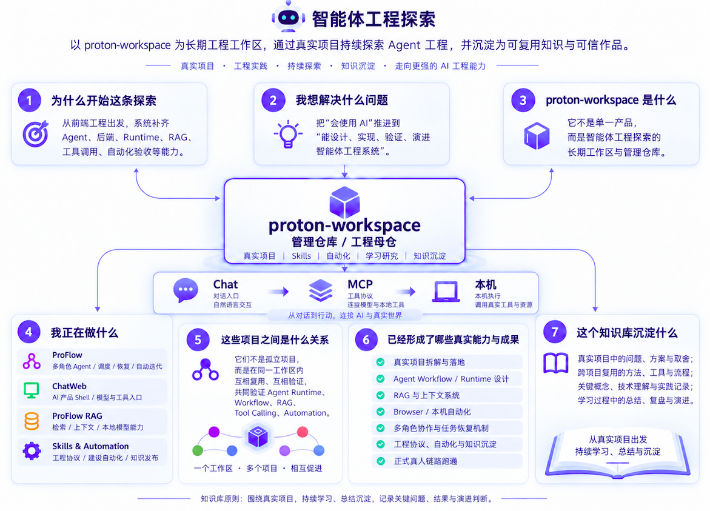

# 智能体工程探索

> **一句话定位**：以 `proton-workspace` 为长期工程工作区，通过真实项目持续探索 Agent、Runtime、RAG、MCP、本机工具链、自动化验收与端侧模型，并把真实实现、失败、验证和演进过程沉淀成可复用的个人工程知识。

这不是一个“把 AI 术语收集起来”的知识库，也不是某个单一产品的说明书。它记录的是一条持续进行的工程探索：我怎样从使用 AI，走到让 AI 真正进入开发环境、调用工具、修改真实系统、读取结果、处理失败，并在长期实践中逐步形成自己的 Agent 工程方法。

本文只维护稳定的总览和长期判断。项目的即时状态、代码实现和验收结果，仍以各项目仓库的 Source / Spec / Test / Runtime Reality 为准。



## 1. 为什么开始这条探索

我的主要工程背景是前端开发。最初真正把 AI 放进开发工作，是从 Cursor、OpenCode 等 Coding Agent 开始的。它们很快证明了一件事：模型已经可以参与写代码、理解局部工程、修改文件和完成相当复杂的开发任务。但一旦任务从“改一个功能”扩大到长期项目、大型重构和多智能体协作，问题就不再只是模型会不会写代码，而是整个工程系统能不能让 AI 持续、稳定地工作。

最先暴露出来的是几类非常具体的问题：

- **模型为什么会开始漂移、丢失关键信息？** 同一个任务持续得越久，上下文越复杂，模型越容易忘记早期约束、混淆当前状态，甚至沿着已经废弃的判断继续工作。问题到底出在上下文长度、信息组织、事实真源，还是任务本身缺少稳定的状态管理？
- **大型重构项目，怎样让 AI 读到足够完整的信息，并真正按计划执行？** 不能每次只给几个文件，也不能把整个仓库无差别塞进上下文。需要知道什么信息必须完整读取、什么可以按需检索，怎样冻结目标、范围、计划和验收条件，并让执行过程始终围绕同一份事实推进。
- **主 Agent 怎样专注主线，同时和子 Agent 高效协作？** 主 Agent 不应该被每个局部实现拖走，但子 Agent 的发现、阻塞、结果和状态又必须及时同步回来。任务怎样拆分、什么时候并行、信息怎样传递、冲突怎样处理、结果怎样重新汇入主线，这些都需要正式机制，而不是靠临时对话维持。
- **AI 怎样真正进入工程环境，而不是只给建议？** 当它需要读取本机源码、执行命令、调用服务、操作页面、修改文件和验证结果时，权限、工具调用、真实状态和失败后的继续执行都变成了工程问题。
- **长期实践怎样留下来？** 一个项目里形成的判断、失败、工具和方法，如果只留在聊天记录里，就很难在下一个项目继续复用。

这些问题逐渐把探索方向从“怎么把 Coding Agent 用得更好”，推向了“怎样建立一套能让智能体长期工作、协作和演进的工程系统”。

## 2. 愿景：让 AI 持续迭代产品

我希望最终形成的不是一个只会回答问题的 AI 助手，而是一套能够持续理解目标、进入真实工程环境、迭代产品，甚至在明确边界和验证机制下参与迭代自身的智能体工程系统。随着重复的分析、执行、验证和维护工作逐步交给 AI，人可以从大量机械劳动中释放出来，把更多精力投入产品判断、创造性设计、复杂问题解决和新方向探索，让有限的时间真正用于创新和更高价值的创造。

## 3. 当前目标

这条探索目前有四个长期目标。

| 目标 | 我真正想解决的问题 |
|---|---|
| 建立真实 Agent 工程能力 | 不停留在 Prompt 和 Demo，真正理解并实现 Workflow、Runtime、Tool、RAG、Memory 等系统能力 |
| 建立长期个人工程工作区 | 让不同项目、工具、Skills、自动化和知识材料可以在一个稳定边界内长期演进，而不是散落在一次次会话里 |
| 用真实项目验证认知 | 每个重要判断尽量回到代码、测试、运行结果和实验数据，而不是只停留在概念理解 |
| 把经验沉淀成可复用知识 | 保存为什么这样设计、哪里失败过、怎样修复、什么可以迁移到下一项目，而不只是记录最终答案 |

这些目标之间不是先学习、再做项目、最后写总结的线性关系，而是持续循环：

```text
学习一个问题
    ↓
放进真实项目
    ↓
遇到实现与边界问题
    ↓
验证 / 失败 / 修复
    ↓
形成新的工程认知
    ↓
沉淀为知识与能力
    └──────────────→ 下一轮实践
```

## 4. `proton-workspace` 是什么

`proton-workspace` 不是一个“大一统 AI 平台”，而是这条探索的长期工程工作区和管理仓库。它负责承载跨项目复用的本机能力、Skills、自动化、长期文档和静态资产；真正的产品仍然保留在各自独立仓库里。

当前最核心的一条本机链路是：

```text
                         ┌────────────────────────────┐
                         │        ChatGPT Chat        │
                         └─────────────┬──────────────┘
                                       │ MCP
                                       ▼
                         ┌──────────────────────────────────────────────────────────┐
                         │              proton-workspace 本机能力层                │
                         │                                                          │
                         │ Local Dev / CodeGraph / Repomix + 编码执行吞吐量         │
                         │        Playwright MCP（眼睛） + 自动化执行               │
                         └────────────────────────────┬─────────────────────────────┘
                                                      │
                               ┌──────────────────────┼──────────────────────┐
                               ▼                      ▼                      ▼
                            ProFlow                 ChatWeb              ProFlow RAG
                               │                      │                      │
                               └──────────────────────┼──────────────────────┘
                                                      ▼
                                             真实工程事实与结果
```

工作区内部的职责也刻意分开：

- `repos/`：独立产品仓库，各自拥有自己的产品真值、构建、发布和 Runtime；
- `tools/`：可复用的原子执行能力；
- `automation/`：已经稳定、适合确定性执行的多步骤机械流程；
- `skills/`：方法、判断、工程协议和可复用经验；
- `docs/`：学习、专题研究、项目实践和正式知识；
- `assets/`：知识库图片等长期静态资产。

这种拆分让“模型负责判断、工具负责执行、项目拥有产品事实、工作区拥有跨项目能力”逐渐变成清晰的责任边界。

## 5. 为什么第一代架构选择 ChatGPT / Custom GPT

选择 ChatGPT 作为第一代智能体架构载体，不只是因为模型能力强，而是因为它同时提供了**高能力模型入口**和**可配置的角色载体**。这两个条件组合在一起，刚好满足了早期从“对话”走向“Agent 工程”的需要。

### 5.1 高能力模型可以直接承担复杂判断

在当前 Plus 使用环境里，Chat 和已有 Custom GPT 都可以直接使用 GPT-5.6 级别的高能力模型，足以承担代码分析、架构判断、技术研究、审计和长链路推理。

固定订阅对个人工程实践还有一个很实际的价值：虽然仍然存在使用频次和模型级限制，但实际使用更接近一个持续可用的高能力工作台，而不是像 API 一样每次调用都围绕 token 成本组织任务。对于长期工程工作，这意味着我可以把更多注意力放在问题本身，而不是不断计算一次分析还能消耗多少上下文预算。

因此 Chat 很适合承担高价值、低确定性的部分：分析、判断、设计、复审和下一步决策；重复、稳定的机械动作再逐步下沉到工具和 automation。

### 5.2 Custom GPT 天然像一个可配置的 Agent Role

Custom GPT 提供的能力和传统“每次重新写 Prompt”有明显区别。一个 GPT 可以保存长期 Instructions、Knowledge 和固定指令，让角色规则、领域知识和工作方式成为稳定 Context；Actions 又可以通过 Schema 和认证连接外部服务，动态获取信息或触发真实操作。

在我的工程建模里，这些产品能力可以自然映射成 Agent 结构：

```text
Custom GPT Definition
├── Instructions        → Role / Behavior / Rules
├── Knowledge           → 固定 Context / Domain Knowledge
├── Capabilities        → 平台内建能力
└── Actions             → 外部 API / Effect Port

GPT 定义本身             → Agent Role / Profile
一次具体 Conversation     → Worker / Session Occurrence
```

还有一个早期非常有价值的细节：**GPT 定义和具体会话实例天然拥有不同的页面身份。** 在实际使用中，可以区分“这是哪个 GPT / 角色”和“这是这个角色的哪一次具体会话”。这和 Agent 系统里的 Role 与 Worker / Conversation 是两个不同身份非常接近。

我不会把网页 URL 当成业务数据库主键，但这种产品原生身份边界减少了早期为了“角色”和“实例”再造一套 UI 与会话系统的成本，也直接影响了 ProFlow 后续对 Role、Worker、Conversation、Binding 和 Wake 的建模。

### 5.3 从第一代载体继续演进

随着系统变复杂，Chat 和 Custom GPT 的职责逐渐分开：

```text
研发 / 工程侧
ChatGPT Chat
    ↓ MCP
Local Dev / CodeGraph / Repomix
    ↓
本机源码、Git、服务与运行事实

产品 / Agent 侧
Custom GPT
    ↓ Actions
Gateway / Public Contract
    ↓
ProFlow Runtime / Task / Tool Capability
```

这套结构证明了“高能力对话入口 + 稳定角色 Context + 外部工具连接”可以成为智能体工程的有效载体，但后续不会把整个系统绑定在 Custom GPT 这一种产品形态上。下一阶段会优先评估 **Chat 项目/对话 + App 的能力组合**，把长期上下文、会话身份、应用连接和真实执行组合成新的智能体入口；如果其他形式的智能体更适合，也可以替换。真正需要长期稳定的不是某一个页面或产品，而是 Role、Context、Task、State、Tool、Runtime 这些工程边界和它们之间的合同。

## 6. 正在做什么，以及已经形成了什么

现在的探索不是围绕一个仓库展开，而是让几个真实项目分别承担不同问题，再通过工作区复用能力和互相验证。为了避免“项目列表”和“成果列表”重复，这里把正在解决的问题与已经形成的能力放在一起看。

| 项目 / 能力 | 正在解决的问题 | 已经形成的能力 / 结果 |
|---|---|---|
| **ProFlow** | 多角色 Agent Workflow、Task / Node、调度、Worker 绑定、唤醒、失败恢复与持续执行 | 已经把单轮对话推进到 Role、Worker、Task、Node、Wake、Failure / Reopen、调度和现实状态协调，并持续用真实任务验证多角色协作与任务恢复 |
| **ChatWeb** | 构建真正面向用户的 Chat 产品壳与 Chat Runtime | Conversation、Streaming、Provider、RAG Context、Citation、Tool / MCP、Web Search、Thinking、附件 / Vision / Voice 等能力已经经过多个阶段真实实现和验收 |
| **ProFlow RAG** | 把知识与上下文能力做成独立、可消费的服务 | 从 Knowledge 构建到 Retrieval、Evidence、Context、Citation、Runtime 和公开 API 已形成完整 V0，并进入长期维护阶段 |
| **端侧模型** | 验证本地模型在真实设备上的角色、参数、性能和服务边界 | 已经从“本地模型能不能跑”推进到真机服务、模型选择、FAST / REASON 角色、推理参数和并发边界的实际验证 |
| **Chat → MCP → 本机工具链** | 让高能力 Chat 真正进入本机工程环境，而不是依赖人工复制信息 | 模型已经可以在权限边界内直接读取源码、分析结构、执行命令、获取运行事实并调用真实工具，形成稳定的工程入口 |
| **Skills & Automation** | 把重复出现的工程方法和机械流程从聊天经验中抽离 | 工程协议、验收、知识发布、本机工具链和稳定自动化开始形成 workspace 级可复用能力，让不同项目共享方法但不共享产品真值 |

这些项目最终都在回答同一个问题：**一个真正能长期工作的 Agent 系统，除了模型以外，还需要哪些工程能力？** 目前逐渐形成的共同认识是：模型负责高价值判断，Runtime 和工具负责真实执行，项目拥有自己的产品真值，自动化负责稳定机械动作，验证负责把“我觉得成功了”变成可复核事实。
