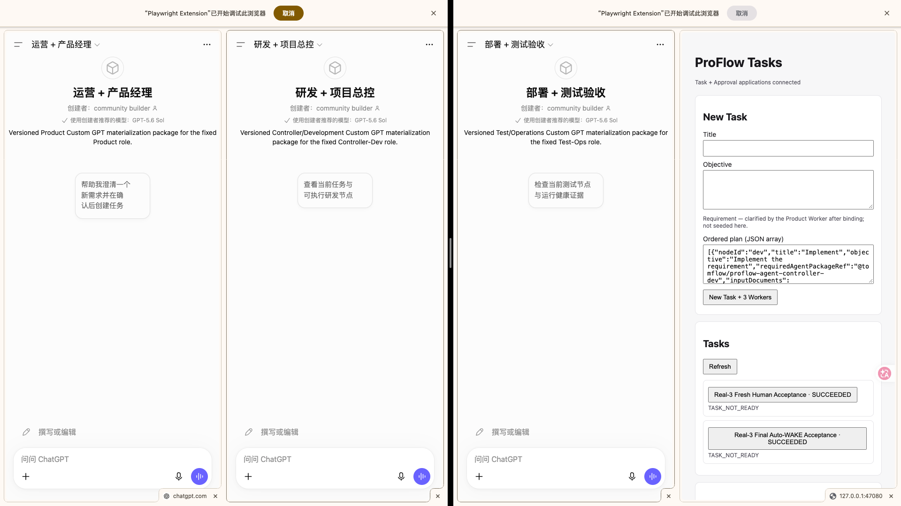

# 智能体工程探索

> **一句话定位**：以 `proton-workspace` 为长期工程工作区，通过 ProFlow、ProFlow RAG、ChatWeb、端侧模型和本机 Agent 工具链等真实项目，持续验证 Agent、Runtime、RAG、Tool、Workflow、Evidence 与 Recovery 等工程问题，并把真实实现、失败、取舍和边界沉淀成可复用的技术知识。

这不是一个“把 AI 术语收集起来”的知识库，也不是某个产品的说明书。它记录的是一条持续发生的工程探索：怎样从“让模型帮我写代码”，走到“让 Agent 能进入真实工程环境、持续推进长期任务、处理失败、留下证据，并把经验带到下一轮”。

本文只维护稳定总览和长期判断。项目的即时状态、当前架构、代码实现和验收结果，仍以各产品仓库的 Source / Spec / Test / Runtime Reality 为准。

## 1. 这套探索到底在回答什么

这套知识不从“有哪些 AI 术语”或“做了多少功能”开始，而是围绕几个可以被真实工程反复检验的问题展开：

- 这里真正解决的工程问题是什么，为什么难；
- 早期方案为什么不够，哪些地方真实失败过；
- 后来为什么改变边界、Owner 或架构；
- 新机制解决了什么，同时付出了什么复杂度；
- 哪些结论有代码、测试、实验或运行事实支持；
- 哪些只是当前设计、历史路线或仍待验证的判断；
- 这些经验离开当前项目以后，哪些仍然可以复用。

因此正式知识不会把“功能很多”当成工程价值，也不会为了展示而隐藏失败。更重要的是把一条完整因果链讲清楚：

```text
Trigger
→ Failure
→ Why
→ Decision / Trade-off
→ Mechanism
→ Evidence
→ Current Boundary
→ Do-not-repeat
```

## 2. 为什么开始这条探索

我的主要工程背景是前端开发。最早真正把 AI 放进开发工作，是从 Cursor、OpenCode 等 Coding Agent 开始的。它们很快证明：模型已经可以理解局部代码、修改文件、生成实现，并完成相当复杂的开发任务。

问题是在任务逐渐变成长期项目、大型重构和多 Agent 协作以后，瓶颈不再只是“模型够不够聪明”。

最先反复出现的是几类工程问题。

**上下文会漂。** 同一个任务持续得越久，事实、约束、计划和历史越多，新窗口或新 Agent 越容易忘记早期决定，把过期信息重新当成当前事实。

**大型任务很难只靠对话保持一致。** 一份目标从规划走到执行，需要范围、验收、当前状态和下一动作长期保持一致。只靠聊天记录，很容易让执行过程逐渐改写最初意图。

**多 Agent 不是多开几个窗口。** 主 Agent、子 Agent、Reviewer 和不同执行器之间需要稳定的身份、任务边界、交接和结果汇入机制，否则并行很快变成重复工作和状态冲突。

**真实副作用不能靠模型说“做完了”。** 文件是否真的修改、进程是否真的启动、浏览器动作是否真的生效、远端资源是否真的更新，都需要现实回读。调用超时以后，如果不知道动作已经发生还是没有发生，盲目重试本身就会制造新的错误。

**同一件事很容易出现多个“看起来都是真的”版本。** Chat、代码、文档、配置、外部知识平台和运行状态同时存在时，如果没有明确 Fact Owner，旧事实会和新事实并存，最终谁也不知道应该相信哪一份。

**一次实践如果只留在聊天里，很难复用。** 真正值得留下来的不是某条最终答案，而是为什么这样设计、哪里失败、怎样修复、什么条件下仍然不成立。

这些问题逐渐把探索方向从“怎么把 Coding Agent 用得更好”，推向了一个更完整的问题：

> **一个真正能长期工作的 Agent 系统，除了模型以外，还需要哪些工程能力？**

## 3. 工程北极星：长期任务必须能够继续，而且能够被证明

这条探索后来形成了一个比“自动化率”或“Agent 数量”更稳定的判断标准：

> **一项工程工作即使经历窗口变化、执行失败、角色接力和产品演进，仍然应该能够基于可信事实继续推进，并留下可复审证据。**

这句话直接决定了很多后续设计。

如果任务必须跨窗口继续，就需要把 Task / State 和 Conversation Memory 分开；如果执行失败后必须恢复，就需要区分“调用失败”和“现实中到底发生了什么”；如果多个 Agent 要协作，就需要明确 Role、Worker、Task 和权限分别由谁拥有；如果结果要可信，就需要 Evidence、Readback、Test 和 Runtime Reality；如果系统长期演进，就不能让旧文档或旧配置继续冒充当前真值。

所以这里一直坚持一个基本分工：

```text
模型
负责理解、分析、推理和高价值判断

Task / Runtime / Tool / Automation
负责状态、约束、确定性执行和真实副作用

Source / Spec / Test / Runtime Reality
负责回答当前事实是什么

正式知识
负责解释这些实践最终说明了什么
```

这也是后面 Context、Task、Evidence、Recovery、Harness、Provider Boundary 等主题会不断出现的原因：它们不是为了把系统设计得复杂，而是为了处理真实工作一旦变长、变多、变得有副作用以后必然出现的问题。

## 4. 为什么最早会先做一个统一平台

早期把这些问题集中到一个统一平台实验里是合理的。

当时需要同时探索 Chat / Custom GPT、Codex、本机 Runtime、Gateway、Task、Agent Assets、Context、Knowledge、Skills、外部知识平台和真实执行链。把它们放进同一个工程载体，可以快速建立共同语言、验证最小链路，并看见原本散落在不同工具里的问题其实互相影响。

第一代体系最重要的价值，不是留下了多少目录，而是把几个过去容易混在一起的概念逐渐分开：

- Planner 的判断和 Executor 的真实写入不是同一件事；
- Session / Conversation 不是稳定 Task；
- 模型提议一个动作，不等于系统已经授权或执行；
- Knowledge、Context、Runtime State 和 Evidence 不是同一种信息；
- Provider 可以替换，长期工程边界不应该绑定某个模型或某个外部工具；
- 目标设计、当前实现、实验观察和历史路线必须区分事实强度。

它也完成过真实的窄链路、治理实验和阶段性实现。这些实践为后来的 ProFlow、RAG、ChatWeb、本机工具链和知识体系提供了大量原始证据。

## 5. 为什么后来不再维持一个“大一统平台”

随着真实项目变多，第一代结构也暴露出另一类问题：**很多复杂度不是业务本身需要，而是因为太多不同生命周期的东西被要求共同服从一套平台结构。**

一个仓库同时承担产品、平台 Runtime、学习材料、正式知识、Agent 资产、实验、Portfolio、发布投影和治理以后，几个问题越来越明显：

- 产品事实、跨项目工具和长期知识拥有不同变化速度，却容易被同一套目录和治理规则绑在一起；
- 为了让文档、代码、外部知识平台和 Agent 资产保持严格关系，曾经引入稳定 ID、Platform Registry、Relation Graph、Projection Mapping 等机制，治理成本逐渐接近知识本身；
- 一些抽象在只有一个真实消费者时就被提前平台化，后来真正的产品边界反而需要重新拆开；
- Context、正式知识、Spec、历史状态和运行事实如果都试图描述“现在是什么”，就容易重新产生第二真源；
- 文档按“学习、调研、实验、复盘、方案”等材料类型组织，对作者方便，却不一定符合外部技术读者理解一个工程问题的顺序。

这不是简单地说明第一代设计“错了”。更准确地说，它完成了一个重要实验：**哪些能力真的需要共享，哪些东西只是在当时被放到了一起。**

后来的收敛原则变成：

> **一个事实尽量只有一个当前 Owner；跨项目只共享真正稳定的工程能力，不共享产品真值。**

知识治理也从“完整机器关系图”收缩成“轻映射、重提炼”：材料可以自然积累，成熟以后按稳定问题进入唯一正式 Owner；需要追溯旧路线时回到 Git，而不是让历史结构永久留在当前知识面。

## 6. 今天的结构：工作区负责公共工程能力，产品仓负责自己的事实

今天的 `proton-workspace` 不再被当成一个“大一统 AI 平台”。它是长期工程工作区和管理仓库，承载跨项目复用的 Tool、Automation、Skill、正式知识和静态资产；真正的产品继续保留在独立仓库里。

### 先分清“脑子、眼睛、手”和治理

如果只用一句话解释这套体系，可以先记住：

> **脑子负责判断，眼睛负责看见现实，手负责改变现实；Task、Skill、Approval、Evidence 和 Recovery 负责让这些动作长期可控。**

它们不是同一种能力。

- **脑子**：ChatGPT Chat、固定 Agent Role 和其它模型能力。负责理解目标、分析、规划、判断下一步，不直接把“我认为完成了”当成现实事实。
- **眼睛**：系统获得真实状态的能力。浏览器侧主要由 Playwright MCP 读取页面、DOM、截图和可见结果；工程侧还包括文件、Git、进程、日志和外部服务的 readback。眼睛的核心职责是回答：**现在真实发生了什么？**
- **手**：系统真正改变现实的能力。本机侧包括 Local Dev 的文件写入、命令、Git 和进程操作；浏览器侧包括受控点击、输入、提交；稳定机械步骤进一步下沉到 Automation。手的核心职责是回答：**怎样把已经批准的动作真实执行出来？**
- **治理与护栏**：Task / Runtime 保存长期状态，Skill 固化方法，Approval / Policy 约束高风险动作，Evidence / Readback 证明结果，Recovery 处理 timeout、UNKNOWN 和中断。它们保证“能看、能做”不会退化成盲操作。

因此 CodeGraph 和 Repomix 更准确地属于**理解现实与构建工程上下文的辅助能力**，而不是“手”；Playwright 既可以作为眼睛观察页面，也可以在被授权时承担浏览器里的动作执行。


这张图表达的是整个工作区的分层：Chat 负责高价值判断，本机能力层提供观察、上下文和执行能力，真实产品各自拥有自己的业务事实，最后所有判断都必须回到真实工程结果。

当前几个核心 Owner 可以这样理解：

| Owner | 它主要回答什么问题 | 它不应该拥有的东西 |
|---|---|---|
| **proton-workspace** | Chat 怎样进入本机工程环境；哪些 Tool / Skill / Automation 可以跨项目复用；长期知识怎样沉淀 | 不复制各产品内部的 Task、Domain、Runtime 和发布真值 |
| **ProFlow** | 长期 Agent 如何拥有 Task、Role / Worker、Execution、Model、Deployment 和恢复语义，并持续推进真实产品工作 | 不把 ChatWeb、RAG 或工作区工具重新吸回自己的领域模型 |
| **ProFlow RAG** | Knowledge 怎样被构建、检索、组织成 Evidence / Context / Citation，并作为独立能力被消费者调用 | 不拥有 Chat 产品体验，也不让消费者重新定义 RAG 内部策略 |
| **ChatWeb** | 一个独立 Web Chat 产品怎样拥有 Conversation / Run、Streaming、Model / Context Provider、Citation、Web Search 与多模态交互 | 当前不再承担 Local Dev、Chrome 控制或 MCP 本机执行平台职责 |
| **端侧模型** | 本地设备怎样作为受 Runtime 治理的推理节点提供语义计算 | 不拥有 Task 状态、系统流转权和真实副作用权限 |
| **Skills / Tools / Automation** | 哪些方法值得复用、哪些能力可以原子调用、哪些机械流程应该确定性执行 | 不因为“跨项目可用”就变成产品事实 Owner |

### 相关仓库

| 工程 | 仓库 |
|---|---|
| proton-workspace | [sayhelloproton-eng/proton-workspace](https://github.com/sayhelloproton-eng/proton-workspace) |
| ProFlow | [sayhelloproton-eng/proflow](https://github.com/sayhelloproton-eng/proflow) |
| ProFlow RAG | [sayhelloproton-eng/proflow-rag](https://github.com/sayhelloproton-eng/proflow-rag) |
| ChatWeb | 当前仅本地仓库，未配置远程 |
| Job Search System | [sayhelloproton-eng/job-search-system](https://github.com/sayhelloproton-eng/job-search-system) |

### 多智能体协作不是“多开几个窗口”

如果从 ProFlow 的真实协作现场看，这套体系也不是“一个模型做所有事”。固定角色、长期 Task、现实观察和执行链必须同时存在。



这张图展示的是三个固定角色与 ProFlow Tasks 面板同时工作的一个切面：

- **Product / Dev / Test 是不同责任，不是三个相同 Chat 的复制品。** Product 负责目标和 Requirement，Dev 负责实现，Test 负责独立验证；
- **Task 面板保存长期任务事实。** Objective、Ordered Plan、Node 状态和结果不依赖某一个 Chat 的记忆；
- **Agent 负责判断，眼睛负责看见真实状态，手负责执行真实动作。** 页面有没有变化、Task 有没有推进、执行有没有真正发生，都必须通过现实回读确认；
- **ProFlow 负责把这些角色放进同一个长期闭环。** 它处理 binding、wake、execution、evidence、recovery 和任务状态，让一次协作可以跨窗口、跨失败继续。

这张图真正想表达的不是“Agent 越多越高级”，而是：**角色分工、长期 Task、眼睛、手和治理必须一起存在，系统才从聊天升级成工程。**

工作区内部也继续保持这种分工：

- `repos/`：独立产品仓库，各自拥有自己的 Source / Spec / Test / Runtime；
- `tools/`：可复用的原子执行能力；
- `automation/`：适合确定性执行的多步骤机械流程；
- `skills/`：方法、判断、工程协议和可复用经验；
- `docs/`：研究、学习、项目材料和正式知识；
- `assets/`：正式知识需要的长期静态资产。

这种拆分最后形成了一条很稳定的原则：

> **模型负责判断，眼睛负责读取现实，工具和 Runtime 负责执行与状态，项目拥有产品事实，工作区拥有跨项目工程能力，正式知识负责解释这些实践。**

## 7. ChatGPT / Custom GPT 为什么曾经是第一代重要载体

第一代架构选择 ChatGPT / Custom GPT，不只是因为模型能力强，而是因为它们同时提供了高能力推理入口、稳定的角色 Context、Conversation，以及连接外部能力的机制。

这使一个很重要的工程区分在早期就变得可观察：

```text
GPT / Agent Role
≠
某一次具体 Conversation / Worker
```

角色可以长期存在，一次 Conversation 则只是某个角色在某次任务中的运行实例。这种区分后来继续影响 ProFlow 对 Role、Worker、Conversation、Binding 和 Wake 的建模。

但实践也证明，Chat 或 Custom GPT 不适合拥有持久 Task 真值、审批真值或真实副作用状态。随着系统变复杂，职责逐渐拆开：

```text
研发工程侧
ChatGPT Chat
→ MCP / 本机事实工具
→ 源码、Git、进程、页面和运行现实

产品 Agent 侧
Agent Carrier
→ Gateway / Public Contract
→ ProFlow Task / Runtime / Tool Capability
```

因此真正应该长期稳定的不是某一种 Chat 产品形态，而是 Role、Task、State、Context、Tool、Runtime、Evidence 等边界以及它们之间的合同。Carrier 和 Provider 都可以随着现实变化而替换。

## 8. 学习、项目、失败和知识不是四条线，而是同一个循环

这套知识不是先“把课程学完”，再去做项目，最后统一写总结。真正有效的路径一直是循环：

```text
遇到一个问题 / 学到一个概念
        ↓
放进真实项目或最小实验
        ↓
观察成功、失败和边界
        ↓
回到 Source / Test / Runtime 找证据
        ↓
调整设计、实现或判断
        ↓
提炼真正稳定的工程认知
        ↓
进入下一轮实践
```

学习进度因此更适合按 Capability Gate，而不是章节数量判断。一个概念至少要能进入真实场景，留下 Evidence、Failure、Boundary 和下一层依赖，才算从“知道这个词”升级成“形成可复用工程能力”。

同样，一次成功也不会自动进入正式知识。原始 Chat、实验记录、日志、阶段计划和历史设计都只是材料。只有当一个问题已经形成稳定机制、证据和边界，才值得进入正式 Owner。

这也是为什么当前知识库不再按“学习 / 调研 / 实验 / 复盘 / 技术方案”作为正式一级结构。材料的产生方式不重要，读者真正需要理解的是：**问题是什么，为什么这样解决，证据在哪里，今天应该相信到什么范围。**

## 9. 怎样判断这里的结论能不能信

正式知识不是当前实现的最高事实源。

当文章涉及“现在系统到底是什么”时，优先级始终回到真实 Owner：

```text
Runtime Reality / External Readback
→ Test
→ Source / Config
→ Current Spec / Accepted Decision
→ Formal Knowledge
→ Historical Material / Inference
```

不同项目的细节顺序可能略有差异，但原则不变：文章负责解释，真实 Source 和 Reality 负责裁决当前事实。

历史材料仍然重要，因为它可以解释为什么某个机制出现、为什么某条路线被替代、哪些错误不应该重走；但历史不能因为写得更完整，就覆盖今天的实现。

## 10. 正式阅读顺序

这套知识有一条明确主线。**本文就是第 01 篇，ProFlow 固定为第 02 篇。** 先看到真实问题和主要成果，再逐层拆开它背后的工程机制，最后回到其它产品、业务工程和术语 Reference。

02. [ProFlow](./ProFlow/README.md)：主要产品和工程成果。先看真实系统怎样把长期 Task、多 Agent、Control Plane、浏览器执行、恢复和真实交付放进同一个闭环。
03. [现代 AI 工程](./现代AI工程/README.md)：给刚看过 ProFlow 的复杂对象补一张完整技术地图，从模型、外部知识、Tool 一路走到 Runtime、Multi-Agent、Eval 与 Platform。
04. [Agent、Skill、Tool、Script 与 Workflow 的职责边界](./Agent工程/Agent-Skill-Tool-Workflow职责边界.md)：先分清判断、方法、原子能力、确定执行和长期状态分别应该由谁负责。
05. [Agent 系统边界建模](./Agent工程/Agent系统边界建模.md)：继续回答领域、身份、Authority、Provider 与运行边界为什么必须拆清。
06. [Task 工程](./Agent工程/Task工程.md)：解释 Goal、Plan、Task、Execution、Handoff、Integration 与 Completion 怎样保护长期意图。
07. [上下文工程](./Agent工程/上下文工程.md)：解释 State、Context、Memory、Knowledge、RAG 与 Runtime Reality 怎样被编译成当前 Agent 真正需要的输入。
08. [知识资产治理](./Agent工程/知识资产治理.md)：解释 Claim、Evidence、事实强度、修订、取代、发布和退役，以及为什么最终选择“轻映射、重提炼”。
09. [专业 Agent 资产化](./Agent工程/专业Agent资产化.md)：解释 Role、运行实例、Harness、Eval 与 Behavior Release 怎样组成可复用专业 Agent。
10. [Agent 工程复杂度与边界](./Agent工程/Agent工程复杂度与边界.md)：回答什么时候值得升级复杂度，什么时候应该主动降级。
11. [Agent 项目治理](./Agent工程/Agent项目治理.md)：解释多个 Task 和 Fact Owner 怎样形成可信阶段基线，而不是依赖进度汇报。
12. [Coding Agent](./工程工具与运行时/Coding-Agent.md)：把前面的长期 Agent 方法放回 Coding Agent、Harness、Runtime 与 Workspace 生态。
13. [本机 Agent 工具链](./工程工具与运行时/本机Agent工具链.md)：解释 Chat 怎样获得工程里的“眼睛和手”，通过 Tool、Skill 与 Automation 进入真实本机环境。
14. [端侧模型](./工程工具与运行时/端侧模型.md)：解释本地设备怎样从模型实验对象收敛成受 Runtime 治理的推理节点。
15. [ProFlow RAG](./ProFlow-RAG/README.md)：用独立 Knowledge Capability 验证 Snapshot、Retrieval、Evidence、Context、Citation、Eval 与 Maintenance。
16. [ChatWeb](./ChatWeb/README.md)：看一个独立 Web Chat 产品怎样组织 Conversation、Streaming、Provider、Search、多模态和交付边界。
17. [AI 业务工程](./AI业务工程/README.md)：在真实系统之后再讨论场景价值、成本、Eval、Observability、Incident、Security、资产化、平台化和组织飞轮。
18. [术语表](./智能体工程术语表/README.md)：作为 Reference 放在主线末尾；任何阶段遇到概念不清都可以随时回查，不需要等到最后才使用。

这里不追求“文档越多越完整”。一个主题只有在已经从过程材料中提炼出稳定问题、机制、取舍、证据和边界以后，才进入正式知识入口；需要追溯更早的路线和原始材料时，再回到 Git 历史和对应项目 Evidence。
